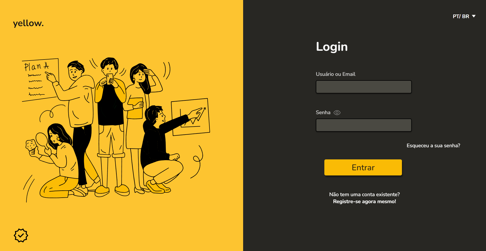
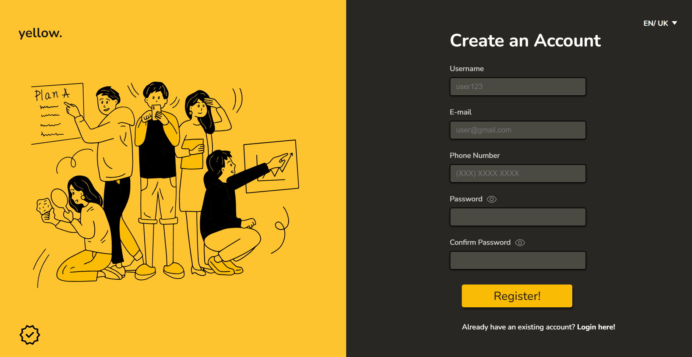

<h1 align="center">Yellow Form🚀👨‍🚀</h1>

<h4 align="center">
    This is a form that consists of validating your registration/login data. 
    I used the browsers' own verification methods and also some methods with Regex for some more specific validations,
    like checking if your password has at least 1 symbol or 1 uppercase character.
</h4>

 

<h4 align = "center">
    <a align="center" href="https://www.frontendmentor.io/solutions/responsive-landing-page-with-html-sass-js-3bxKOMxrxW">Yellow Form.</a>
</h4>

 

<h6 align="center"> This project was created with:</h6>
 
 

  
  
  
  
 

  

<!-- Desktop -->
<h2 align="center">Desktop Version 🖥️</h2>

  

<!-- Mobile -->
<h2 align="center">Mobile Version 📱</h2>

<!--Made By Gustavo J. Souza -->

<!--Made By Gustavo J. Souza -->
